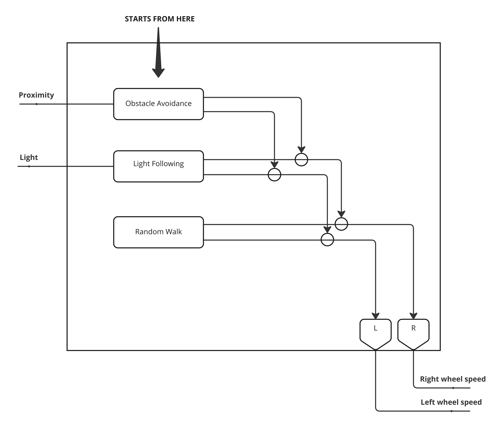

# Notes
The robot control program is designed on the basis of the subsumption architecture.
The architecture is designed with an incremental approach and is composed by three layers (competences) here described from the lower to higher priority:

- **Random walk**: the basic competence of the robot is to walk randomly in the arena.
- **Light following**: then, considering an environment without obstacles, the next competence is the ability to reach a light source. In fact this layer inhibits the random walk layer when it senses light otherwise it will delegate the random walk to the lower level.  *achieving behavior*. It takes as input the light sensor and returns as output the left and right wheel speed.
- **Obstacle avoidance**: the last competence is the ability to avoid obstacles. When this layer sense dangerous obstacles then it will inhibit the lower layers otherwise it will delegate the work to them. *maintenance goal*. It takes as input the proximity sensor and returns as output the left and right wheel speed.

Each layer's strategy was taken from the previous lab with only a change in the speed formula to decrease speed with the distance from the light.

As described the priorities are static with the highest priority on the obstacle avoidance behavior and with the lower priority on the random walk behavior.
The layers were designed considering this principle: *the last layer is the responsible one respect to the final behavior*. So the resulting strategy is extensible and additional competences/behaviors (with an higher level of abstraction) can be added on top (or we can perform a cut at any layer and the robot behavior will remain a valid one - considering the remained layers).

The strategy to implement this on code is simple: each layer is identified by a function that receives as input the optional inhibitions and returns the outputs (left and right wheel speed). 
In this way the code that remains in the ``step`` function is simple: the call to the highest priority competence and the command to the motors.

So the control starts from the highest priority behavior in order to explicitly implement the inhibition that otherwise would remain implicit in the behavior's code.

In order to add a new competence on top we simply need to:

- implement the new function that implements the behavior
- change the first behavior to use in the ``step`` function

## Variant 1 - Add more robots
Considering that the strategy used is similar, the results are similar to the last exercise of the first lab.

## Variant 2 - Add noise to actuators and sensors
The difficulties for the robot increase but with limited amount of noise it manages to reach its goal.

## Variant 3 - Light of different intensity and height
Obviously when the light is higher with an higher level of intensity then it is more visible all over the arena. This will result on less random walk by the robot trying to find it and so a quicker convergence towards it.

## Performance
I have done a simple evaluation of the performances counting how many times the robot can reach the light in a given time measured by the ticks of the simulation (experiment length * ticks per second). The limit distance to consider the experiment succeeded is 0.40 (distance that consider a bit also the unlucky case of the light closed all the round by boxes).

Consider that results will depend on the starting position of the robot and on the fact that the robot can effectively see and reach (due to obstacle disposition) the light (depending on the random walk to find it when not visible). 
So in order to have an average result I will perform 10 simulations for each setup.

The arena has a size of 4 * 4.
The arena has the following obstacles disposed randomly:

- 15 boxes
- 4 large obstacles
- 3 high obstacles

Here are the results:
| Ticks | Light intensity | Light height | Succeeded simulations |
| ----- | --------------- | ------------ | --------------------- |
| 3000  | 2               | 0.5          | 9/10                  |
| 1500  | 3               | 0.8          | 8/10                  |

### Considerations

In the first setup the failed simulation was due the disposition of obstacles around the light that don't allow the robot to reach it on time.
In the second setup due to the limited amount of time, if the light was far from the starting position of the robot and there were a lot of obstacles in between that could also avoid the light to be sensed then the time to find and reach it will depend on the random walk to find the light.

These results also depend on the high number of obstacles present.
I had observed that with fewer obstacles the results were higher and in almost all the simulations the robot could reach the light on time.
